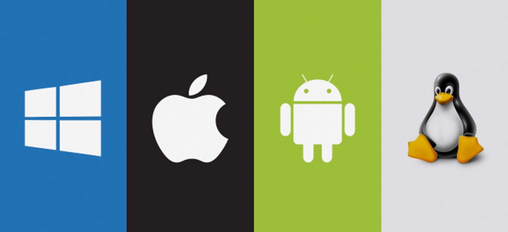
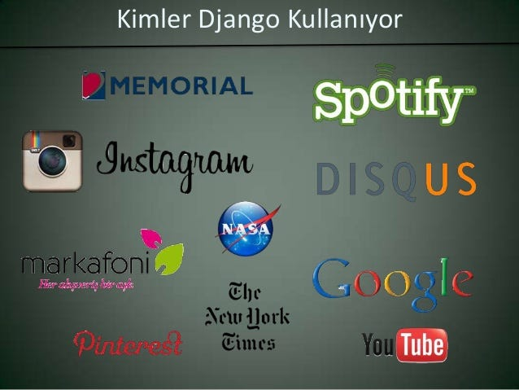

{width="3.308333333333333in"
height="1.8604166666666666in"}

**Django Framework Nedir?**

***Django***; Python programlama dilinde yazılmış, açık kaynaklı bir web
uygulama çatısıdır. Bu çatı sayesinde web uygulamalarınızı daha hızlı ve
de daha güvenli bir şekilde oluşturabilirsiniz.

Django web uygulamaları için çok sayıda hazır bileşen sunmaktadır.
Mesela; veritabanı işlemleri, oturum yönetimi, kullanıcı yetkilendirme
ve doğrulama, şablon yönetimi gibi birçok konuda hazır çözümler
sunmaktadır. Bu da geliştirme süresini ve maliyetini azaltır.

Django ayrıca güçlü bir ***ORM (Object-Relational Mapping)*** aracı olan
Django ORM\'yi içermekte ve de bu araç sayesinde de veritabanı işlemleri
yapmak çok kolaydır. Ayrıca bunların haricinde de Django REST Framework
(DRF) gibi birçok üçüncü taraf kütüphane de mevcuttur ve de bu
kütüphaneler RESTful API\'ler oluşturmanıza da yardımcı olmaktadır.

Django\'nun en önemli avantajı açık kaynaklı olması ve de geniş bir
topluluk tarafından desteklenmesidir. Bu sayede de sorunlarınızı çözmek
için çok sayıda kaynak ve yardımı da mevcuttur. Özetlememiz gerekirse
Django, hızlı ve güvenli bir şekilde web uygulamaları oluşturmanıza
yardımcı olan, hazır bileşenler sunan ve Python programlama diline
dayalı bir web uygulama çatısı olarak karşımıza çıkmaktadır.







**Django\'nun Yararları**

**1. Hızlı geliştirme**

Django, hazır bileşenler ve araçlar sağlayarak hızlı bir geliştirme
süreci sunar. Django, kod tekrarını önlemek ve tekrar kullanılabilirliği
artırmak için birçok hazır kütüphane ve de modül içermektedir.

**2. MVC mimarisi**

***Model-View-Controller (MVC)*** mimarisini kullanarak kodun daha kolay
okunmasını ve anlaşılmasını sağlamaktadır. Bu sayede geliştiricilerin
daha verimli çalışmalarını ve hızlı bir şekilde değişiklik yapmaları
sağlanır.

**3. Güvenlik**

Django; önemli güvenlik özellikleri sağlar ve web uygulamalarının
saldırılardan korunmasına yardımcı olmakta ve de saldırganların oturum
açma bilgilerini ele geçirmesini önlemek için oturumlarla ilgili
güvenlik önlemleri sunmaktadır.

**4. Ölçeklenebilirlik**

Bu çatı büyük ölçekli uygulamalar için tasarlanmış ve yüksek trafikli
web siteleri ile başa çıkmak için ölçeklenebilir bir yapıya sahiptir.
Django, birçok sunucu ve veritabanı desteği sağlamaktadır.


**5. Tam özellikli admin arayüzü**

Django, geliştiricilerin bir yönetici arayüzü oluşturmalarına izin veren
tam özellikli bir yönetici paneli içermektedir. Bu da geliştiricilerin
web uygulamalarının yönetimini kolaylaştırır ve kullanıcıları yönetmek
için zaman kazandırmaktadır.


**6. Topluluk desteği**

Bu uygulama büyük bir açık kaynak topluluğuna sahiptir ve bu topluluk
tarafından sürekli olarak güncellenir ve de geliştirilmektedir. Bu
sayede geliştiricilerin sorunlarını çözmelerine ve yeni özellikler
eklemelerine yardımcı olmaktadır. 


**7. Çoklu dil desteği**

Django; birden fazla dilde web uygulamaları oluşturmak için
kullanılabilir.

Yukarıda yer alan 7 madde Django kullanmanın yararlarından sadece
birkaçıdır. Django birçok işletmenin web uygulamaları geliştirmek için
tercih ettiği popüler bir web framework\'üdür

**Django Özellikleri
Nelerdir?**

**Django**, web uygulama geliştirmek için birçok özellik sunmaktadır. Bu
özelliklere bakacak olursak:

● **Veritabanı Yönetimi**

Django, birçok veritabanı yönetim sistemi ile uyumlu çalışır ve ORM
aracılığıyla veritabanı işlemlerini kolaylaştırmaktadır.

● **Şablon Yönetimi**

HTML şablonlarını kullanarak web sayfaları oluşturmanızı sağlar ve
şablonlar aracılığıyla verileri dinamik olarak görüntüleyebilirsiniz.

● **Oturum Yönetimi**

Kullanıcıların oturumlarını yönetmenizi sağlar ve kullanıcıların
oturumlarını güvence altına almaktadır.

● **Kullanıcı Yetkilendirme ve Doğrulama**

Django, kullanıcıların kimlik doğrulamasını ve yetkilendirilmesini
sağlayan güçlü bir yetkilendirme sistemi sunmaktadır.

● **Admin Paneli**

Bir web uygulaması için yönetim paneli oluşturmanıza yardımcı olur ve
yönetim görevlerini kolaylaştırır.

● **Güvenlik**

Web uygulamalarının güvenliğini artırmak için bir dizi güvenlik önlemi
sağlamaktadır.

● **Ölçeklenebilirlik**

Büyük ölçekli web uygulamalarını kolayca ölçeklendirmenize olanak
tanıyan birçok özellik sunmaktadır.

● **RESTful API**

RESTful API\'ler oluşturmak için Django REST Framework (DRF) gibi üçüncü
taraf kütüphaneler sağlar.

Tüm bu özellikler; Django\'nun web uygulama geliştirme için neden
popüler bir seçim olduğunu göstermektedir.

{width="3.634027777777778in"
height="1.9111111111111112in"}



**Uygulamaların Geliştirilmesi**

Django ile web uygulamaları geliştirmek oldukça kolay. İşte Django ile
uygulama geliştirmenin temel adımları:

**1. Django Projesi Oluşturma:** Django projesi oluşturmak için
terminalde \"django-admin startproject project_name\" komutunu
çalıştırabilirsiniz. Bu Django projesi için temel yapıyı oluşturur.

**2. Uygulama Oluşturma:** Uygulama oluşturmak için terminalde \"python
manage.py startapp app_name\" komutunu çalıştırabilirsiniz. Bu da
uygulamanız için temel dosya ve klasörleri oluşturur.

**3. Veritabanı Oluşturma:** Django ile veritabanı oluşturmak için
\"models.py\" dosyasında modeller oluşturmanız gerekmektedir. Söz konusu
olan bu modeller, veritabanında depolanacak verilerin yapısını tanımlar.
Daha sonra da \"python manage.py makemigrations\" komutuyla veritabanı
için bir veri tabanı oluşturma planı oluşturulur ve de daha sonrada
\"python manage.py migrate\" komutuyla veritabanı oluşturulur.

**4. Görünümler ve URL\'ler:** Django\'da görünümler; uygulamanızın
işlevselliğini tanımlar. Görünümler, URL\'lerle ilişkilendirilir ve bir
URL\'ye bir istek yapıldığında görünüm çalışır. URL\'lerin
yönlendirilmesi için \"urls.py\" dosyası kullanılır.

**5. Şablonlar (Templates):** Django\'da şablonlar, web sayfalarının
HTML görünümünü belirlemek için kullanılmaktadır. Şablon dosyaları, HTML
kodu içerir ve dinamik içerik için verilerle birleştirilebilir.

**6. Statik Dosyalar:** Django ile statik dosyalar (örneğin, CSS,
JavaScript ve resimler) uygulamanızda kullanılabilir. Bu dosyalar da
uygulama dizininin \"static\" klasöründe saklanılır.

**7. Testler:** Django, uygulamanızı test etmek için birçok test aracı
sunar. Testler, uygulamanızın doğru şekilde çalıştığını ve
beklentilerinize uygun sonuçlar verdiğini doğrulamanıza yardımcı
olmaktadır.

Bahsettiğimiz adımlar; ***Django ile uygulama geliştirmenin temel
adımları***dır. Django\'nun hazır bileşenleri sayesinde bu adımların
çoğunu daha hızlı ve kolay bir şekilde gerçekleştirebilirsiniz.


**Django da İşletim Sistemleri
Desteği**{width="7.013888888888889in"
height="3.213888888888889in"}

***Django***, Python dilinin bir web framework\'üdür ve Python\'un
çalıştığı tüm işletim sistemlerinde çalışabilmektedir. Bundan ötürü de
Django Windows, MacOS ve Linux dahil olmak üzere hemen hemen tüm işletim
sistemleriyle uyumludur. Django\'nun çalışması için tek gereksinim
Python yüklü olmasıdır. Django, Python\'un herhangi bir sürümünü
destekler ve Python\'un farklı sürümlerinde de çalışabilir.

Ayrıca farklı veritabanı yönetim sistemlerine (DBMS) de uyumlu olarak
çalışabilir. ***Django***, SQLite, MySQL, ***PostgreSQL*** ve Oracle
gibi popüler veritabanı yönetim sistemlerini desteklemektedir.

Yani genel olarak baktığımızda Django, farklı işletim sistemlerinde
çalışabilen ve farklı veritabanı yönetim sistemleriyle uyumlu olan bir
web framework\'üdür. Bu da Django\'yu, farklı platformlarda uygulama
geliştirme ihtiyacı olan geliştiriciler için uygun bir seçenek haline
getirir.



{width="4.2375in"
height="1.1006944444444444in"}
**Django Güvenlik Özellikleri**

Django ayrıca web uygulamaları için birçok güvenlik özelliği
sunmaktadır. Aşağıda Django\'nun en önemli güvenlik özellikleri yer
almaktadır:

● **Cross-Site Scripting (XSS) Koruması**

XSS saldırılarına karşı koruma sağlayan birçok önlem içerir. Djangok
ullanıcı girdilerini varsayılan olarak temizler ve varsayılan olarak
HTML kodu yerine kaçış karakterleri kullanmaktadır. Böylelikle kullanıcı
girdileri otomatik olarak güvenli hale getirmektedir.

● **Cross-Site Request Forgery (CSRF) Koruması**

CSRF saldırılarına karşı da koruma sağlamaktadır. Django, bir web
sayfasının sunucuya yaptığı isteğin sunucu tarafından doğrulanmış bir
istek olup olmadığını da kontrol etmektedir.

● **SQL Injection Koruması**

SQL injection saldırılarına karşı da koruma sağlar. Django\'nun ORM\'si
(***Object-Relational Mapping***) kullanılarak yapılan tüm veritabanı
işlemleri, otomatik olarak SQL injection saldırılarına karşı korunarak
vazifesini yerine getirir.

● **Güvenli Parola Depolama**

Django sistemi, parolaları güvenli bir şekilde depolamak için hashleme
yöntemi kullanarak parolaları salt\'layarak (tuzlama) ve hashleyerek
depolama yapar. Bu yöntem sayesinde saldırganların kullanıcıların
parolalarını kırmasını zorlaştırmaktadır.

● **Yetkilendirme ve Kimlik Doğrulama**

Kullanıcıların kimliklerini doğrulamak için farklı yetkilendirme
yöntemleri sunmakta varsayılan olarak bir kullanıcının kimliğini
doğrulamak için kullanıcı adı ve parola kullanmaktadır. Tüm bunların
haricinde Django, farklı yetkilendirme backend\'leri ile uyumlu olup
özelleştirilebilir.

● **Güvenli Veri Aktarımı**

HTTPS (HTTP Secure) protokolünü destekler ve bu sayede verilerin güvenli
bir şekilde aktarılmasını da sağlamaktadır.

Bahsetmiş olduğumuz bu çatı; web uygulamaları için birçok güvenlik
özelliği sunmaktadır. Bu özellikler sayesinde de geliştiriciler Django
kullanarak güvenli ve güvenilir web uygulamaları
geliştirebilmektedirler.


{width="3.683333333333333in"
height="2.765277777777778in"}


**Django Kullanan Web Siteleri Nelerdir?**

***Django*** birçok büyük ve popüler web sitesi tarafından
kullanılmaktadır. Aşağıda Django kullanan bazı örnek web siteleri yer
almaktadır:

**Instagram**

Dünyanın en popüler fotoğraf paylaşım uygulamalarından biri olan
Instagram Django ile geliştirilmiştir.

**Mozilla**

Mozilla açık kaynaklı bir web tarayıcısı olan Firefox\'u geliştirir.
Mozilla\'nın web sitesi de Django ile geliştirilmiştir.

**The Washington Post**

ABD\'nin önde gelen gazetelerinden biri olan The Washington Post\'un web
sitesi de Django ile geliştirilmiştir.

**Pinterest**

Pinterest, görsel paylaşım ağı olarak bilinmektedir.

**Spotify**

Spotify, müzik dinleme platformudur.

**Dropbox**

Bulut depolama ve dosya paylaşım hizmeti sunar ve Django ile
geliştirilmiştir.

**YouTube**

Dünyanın en popüler video paylaşım platformlarından biri olan YouTube'da
Django ile geliştirilmiştir.

**Eventbrite**

Eventbrite etkinlik yönetimi platformu olarak bilinir

Bunlar sadece ***Django kullanan web siteleri*** arasından birkaç
örnektir. Django birçok farklı alanda kullanılan ve birçok popüler web
sitesinde kullanılan bir web framework olduğunu buradan anlayabiliriz.


{width="4.686805555555556in"
height="2.8118055555555554in"}

**Django Yazılım Örnekleri**

Django birçok farklı uygulama ve web sitesi için kullanılabilir yapıya
sahiptir. Bu konuda sizlerle Django ile geliştirilmiş bazı örnek
yazılımları paylaşmak istiyoruz.

● **E-Ticaret Sitesi**

Django sistemi , e-ticaret siteleri için oldukça popüler bir seçimdir.
Django\'nun sunduğu özellikler sayesinde; satışları yönetmek, müşteri
siparişlerini takip etmek ve farklı ödeme seçenekleri sunmak gibi
işlemler oldukça kolaylaşmaktadır.

● **Sosyal Ağ**

Sosyal ağ siteleri için de popüler bir seçimdir. Django\'nun sunduğu
kullanıcı hesapları; arkadaş ekleme, mesajlaşma ve paylaşım özellikleri,
sosyal ağlar için idealdir.

● **Blog**

Django, blog siteleri için de kullanılabilir. ***Django\'nun sunduğu
otomatik URL yönlendirmesi***, yorum işlevleri ve kullanıcı yönetimi
özellikleri sayesinde blog yazmak oldukça kolaydır.

● **Eğitim Yönetim Sistemi**

Ayrıca Django eğitim yönetimi yazılımları için de kullanılabilir.
Öğrenci ve öğretmen hesapları, derslerin yönetimi, notlandırma, ders
materyalleri ve ödevlerin yükleme özellikleri gibi birçok işlem Django
ile kolayca oluşturulabilmektedir.

● **İş Yönetim Aracı**

Django, iş yönetim araçları için de kullanılmaktadır. Mesela ;
projelerin yönetimi, görevlerin atanması, takip edilmesi ve
raporlanması, Django sayesinde kolayca yapılabilir.

Bahsetmiş olduklarımız sadece birkaç örnek olup Django\'nun birçok
farklı uygulama için kullanılabileceğini göstermektedir. Django oldukça
güçlü ve esnek bir web frameworküdür ve de ihtiyacınız olan hemen hemen
her tür web uygulamasını geliştirmenize olanak sağlayacaktır

{width="3.7506944444444446in"
height="3.0006944444444446in"}

**Django'nun Alternatifleri**

Django, Python dilinde web uygulamaları geliştirmek için popülerdir.
Fakat başka Python web framework\'leri de mevcuttur ve de bazı
durumlarda farklı ihtiyaçlara daha uygun olabilmektedirler. İşte
Django\'nun alternatifleri:

**1. Flask**

Flask, minimalist bir Python web framework\'üdür. Django\'dan daha
hafiftir ve daha az yapılandırma gerektirmektedir. Fakat küçük ölçekli
projeler için idealdir ve daha az özellikleri sayesinde daha hızlı bir
geliştirme süreci sunmaktadır.

**2. Pyramid**

Pyramid modüler bir Python web frameworküdür. Django\'dan daha esnek ve
daha az önyargılıdır. Pyramid, büyük ölçekli projeler için daha uygun
olan bir yapı olup ve de özellikle kompleks uygulamalar için güçlü bir
seçenek olarak karşımıza çıkmaktadır.

**3. Bottle**

Daha çok minimalist bir Python web frameworküdür ve de Flask ile benzer
bir felsefeye sahiptir. Django\'dan daha hafif ve daha az yapılandırma
gerektiren Bottle küçük ölçekli projeler için fazlasıyla idealdir ve de
özellikle API geliştirme işlemleri için popülerdir.

**4. CherryPy**

CherryPy; bir web sunucusu ve Python web frameworküdür. Django\'dan daha
hafif ve daha hızlıdır. CherryPy genel olarak baktığımızda daha küçük
ölçekli projeler için ideal olup, temiz ve anlaşılır bir kodlama stilini
teşvik etmektedir.

**5. Tornado**

Tornado, asenkron bir Python'dur. . Django\'dan daha hızlıdır ve de
gerçek zamanlı uygulamalar için oldukça iyidir. Tornado, büyük ölçekli
web siteleri ve ağ uygulamaları için güçlü bir tercih olacaktır.




Yukarıda sıralamış olduğumuz Frameworklar Django\'nun alternatiflerinden
sadece birkaçıdır. Hangi web framework\'ünün kullanılacağınızı projenin
ihtiyaçlarına ve ölçeğine göre şekilleneceğini unutmamalısınız. Her web
framework\'ünün kendine özgü avantajları ve de dezavantajları
bulunmaktadır. Yapacağınız seçiminiz, projenizin özelliklerine ve
gereksinimlerine göre olmalıdır. Bunu da göz ardı etmemek gerekmektedir.
